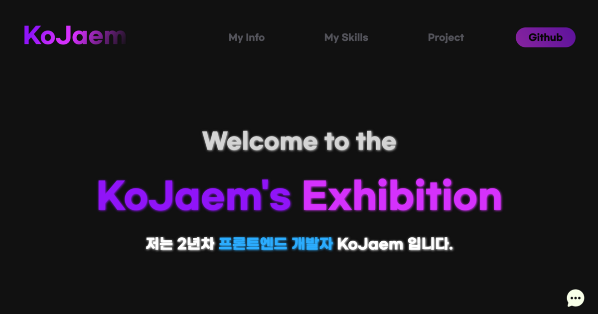

# Interactive-portfolio

## 팀원
### 개인 프로젝트

## 소개

### "나에 대한 정보를 좀 더 흥미롭게 해보자"
이력서를 제출하거나, 대외활동을 참여하는 등 저를 처음 보시는분께 제 자신을 어필해야할때 여러사람들 사이에서 
나를 돋보이게 할 수 있는 방법이 뭐가 있을까? 라는 생각에서 이 프로젝트를 진행하게 되었습니다.

인터렉티브한 요소를 적절히 사용하면서 사용자의 몰입도를 증가시키려고 노력하였습니다.

> [!NOTE]  
> 우측 하단에 있는 말풍선 아이콘을 통하여 제 비서 챗봇 KoJaem GPT🤖와 대화를 나누면서 저에 대한 질문을 할 수 있습니다.(Access Key 필요)

## 기술 Stack

### Frontend

|Next.js|TypeScript|Framer-motion|Styled-components|Recoil|
|--|--|--|--|--|

### Backend
|Supabase|
|--|

### Deploy
|AWS S3| CloudFront |AWS-Lambda (Serverless)|
|--|--|--|

### AI
|LangchainJS|
|--|

## 배포 주소
https://kojaem-exhibition.site

## 페이지 보기

### 메인 페이지
|||||
|--|--|--|--|
|첫 화면|Projects|Flutter 게임|Langchain 챗봇|

### 프로젝트 갤러리

|||
|--|--|
|첫 화면|프로젝트 자세히보기(모달 우측하단 버튼)|

### 페이지 전환 애니메이션
|||
|--|--|
|메인 페이지-> 프로젝트 갤러리|프로젝트 갤러리 -> 메인 페이지|

